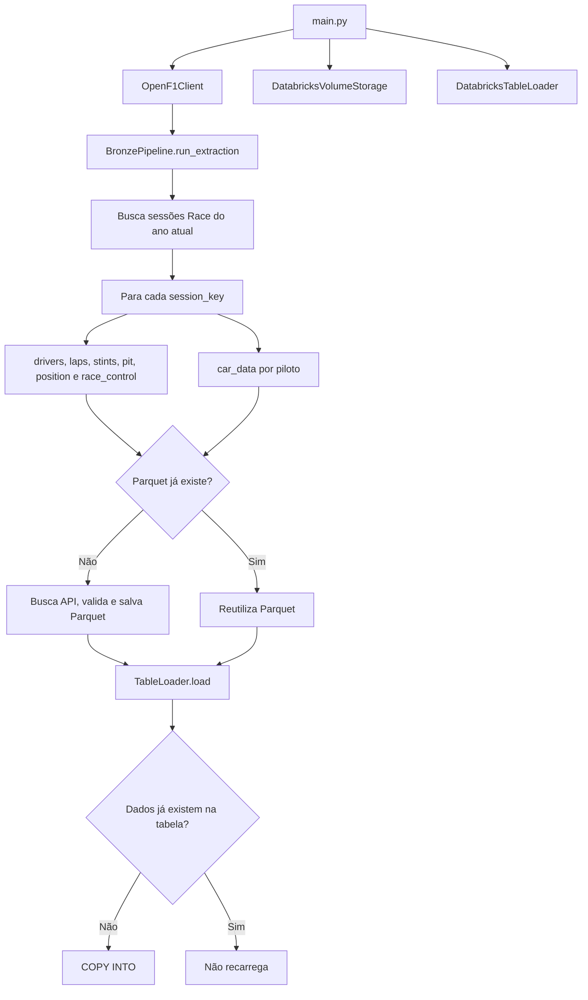

# Fluxo da camada Bronze

Este documento descreve o fluxo iniciado por `main.py`.

## Visão geral



## 1. Início no `main`

`main()` mede o tempo de execução, instancia `OpenF1Client`,
`DatabricksVolumeStorage` e `DatabricksTableLoader`, e passa esses objetos ao
`BronzePipeline`. Em seguida, chama `run_extraction()`.

As classes de Volume e de Loader leem as variáveis de ambiente e falham com
`ValueError` se faltar alguma configuração. Erros HTTP da OpenF1 ou do
Databricks também sobem até o `main`, são exibidos e relançados.

## 2. Sessões que entram no fluxo

O pipeline chama `/sessions` com:

```python
{
    "year": ano_atual,
    "session_name": "Race",
    "is_cancelled": False,
}
```

Cada resposta fornece um `session_key`. Todo o fluxo abaixo é repetido para
cada sessão.

## 3. Endpoints e destinos

Os endpoints normais são processados nesta ordem:

```text
drivers → laps → stints → pit → position → race_control
```

| Fonte OpenF1 | Arquivo no Volume | Tabela Bronze |
| --- | --- | --- |
| `/drivers` | `drivers.parquet` | `f1_plataform_data.bronze.drivers` |
| `/laps` | `laps.parquet` | `f1_plataform_data.bronze.laps` |
| `/stints` | `stints.parquet` | `f1_plataform_data.bronze.stints` |
| `/pit` | `pit.parquet` | `f1_plataform_data.bronze.pits` |
| `/position` | `position.parquet` | `f1_plataform_data.bronze.position` |
| `/race_control` | `race_control.parquet` | `f1_plataform_data.bronze.race_control` |

O arquivo mantém o nome da fonte: `/pit` gera `pit.parquet`. O Loader faz o
mapeamento especial `pit → pits` apenas para a tabela.

## 4. Quando o arquivo ainda não existe

Para cada fonte, `DatabricksVolumeStorage.exists()` faz um `HEAD` no arquivo:

```text
{path_volume_databricks}/session_key={session_key}/{source}.parquet
```

Se receber `404`, o pipeline:

1. busca os dados na API OpenF1 usando o `session_key`;
2. seleciona o validador da fonte;
3. transforma os registros em `pandas.DataFrame` e Parquet;
4. cria o diretório da sessão e envia o arquivo ao Volume;
5. chama o Loader para carregar o arquivo na tabela Bronze.

Há uma espera de dois segundos depois da busca dos endpoints normais.

## 5. Quando o arquivo já existe

Para `laps`, `stints`, `pit`, `position` e `race_control`, a API não é chamada
novamente. O pipeline somente chama o Loader, permitindo completar uma tabela
que ainda não tenha recebido o Parquet já salvo.

`drivers` é a exceção: ele sempre consulta o endpoint antes da verificação do
arquivo porque precisa obter os `driver_number` usados no `car_data`.

## 6. Carga da tabela Bronze

Antes do `COPY INTO`, `DatabricksTableLoader.exists()` consulta a tabela:

```sql
SELECT 1
FROM <tabela>
WHERE session_key = :session_key
LIMIT 1
```

Para telemetria, também filtra `driver_number`. Se não houver registro, o
Loader executa:

```sql
COPY INTO <tabela>
FROM '<caminho-do-parquet>'
FILEFORMAT = PARQUET
```

Assim, a reexecução é protegida em duas camadas: primeiro pelo arquivo no
Volume, depois pelos dados já presentes na tabela.

## 7. Telemetria: `car_data`

Ao terminar os endpoints normais, `extract_car_data()` percorre os pilotos
obtidos em `drivers`. Para cada piloto, usa a fonte
`car_data_driver=<driver_number>`.

```text
car_data_driver=44.parquet
    → f1_plataform_data.bronze.car_data
```

Quando ainda não existe, chama `/car_data` com `session_key` e `driver_number`,
valida, salva e carrega. Quando existe, somente verifica/carrega a tabela. Há
uma espera de três segundos entre os pilotos.

## 8. Atenção ao comportamento atual

Se a validação reprovar os dados, `save()` não cria o Parquet. Mesmo assim, o
pipeline continua e chama o Loader; nesse cenário, o `COPY INTO` pode falhar
por não encontrar o arquivo. Isso descreve o comportamento atual e não foi
alterado nesta documentação.

## 9. Responsabilidades por arquivo

| Arquivo | Responsabilidade |
| --- | --- |
| `main.py` | Monta as dependências e inicia o pipeline. |
| `src/bronze/extractor/extractor.py` | Controla extração, reuso e telemetria por piloto. |
| `src/Request/OpenF1_Client.py` | Chama a API OpenF1. |
| `src/bronze/storage/volume.py` | Valida e persiste Parquets no Volume. |
| `src/bronze/load/table.py` | Mapeia fontes, consulta tabelas e executa `COPY INTO`. |
